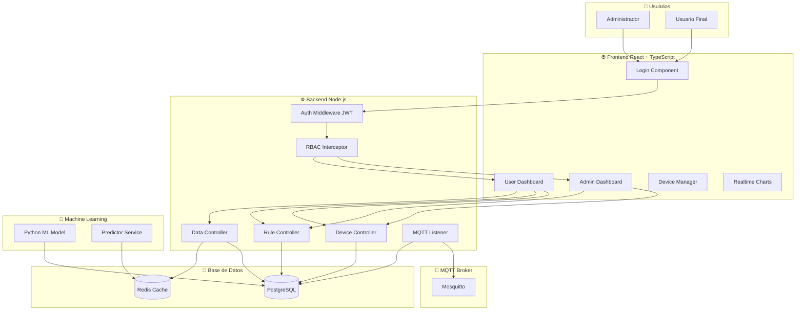
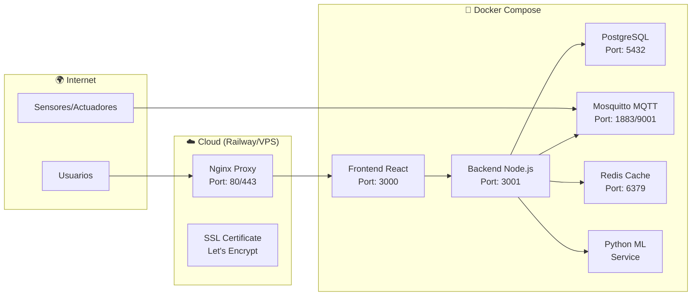
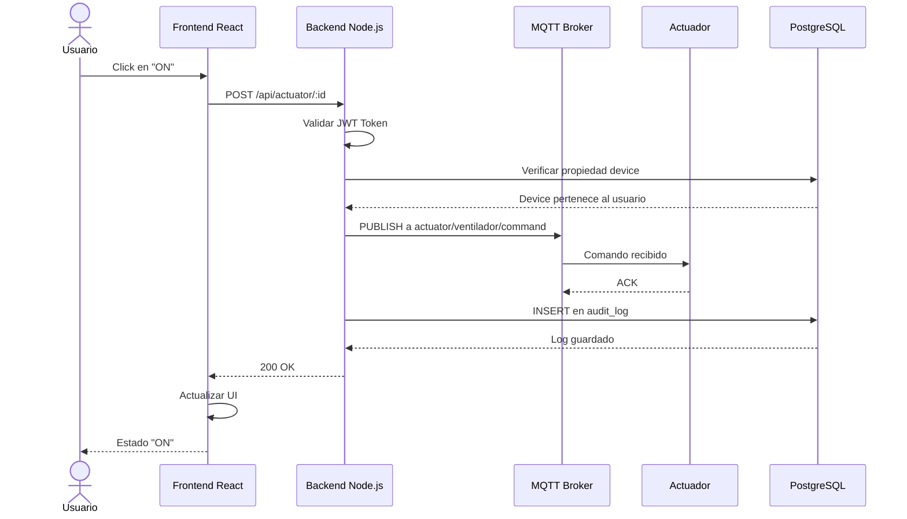
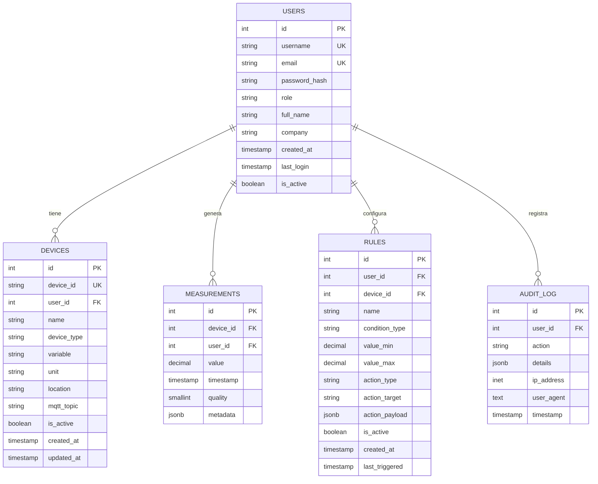

# 🌐 Plataforma IoT con Aprendizaje Continuo


[](https://www.docker.com/)
[](https://www.typescriptlang.org/)
[](https://reactjs.org/)
[](https://www.postgresql.org/)

> **Tesis de Maestría - Arquitectura IoT Modular con Multi-tenant y Aprendizaje Continuo**

---

## 📋 Tabla de Contenidos
- [Descripción](#descripción)
- [Arquitectura](#arquitectura)
- [Diagramas](#diagramas)
- [Requisitos](#requisitos)
- [Instalación](#instalación)
- [Uso](#uso)
- [API Endpoints](#api-endpoints)
- [Despliegue](#despliegue)
- [Pruebas](#pruebas)
- [Contribuciones](#contribuciones)
- [Licencia](#licencia)

---

## 📖 Descripción

Esta plataforma IoT permite el monitoreo y control de dispositivos en tiempo real a través de una arquitectura modular y multi-tenant. Los datos son recibidos mediante MQTT, almacenados en PostgreSQL, y visualizados en un dashboard interactivo. Además, implementa un modelo de aprendizaje continuo para predicción de tendencias.

### 🎯 Objetivos

1. **Arquitectura modular** de datos con soporte multi-tenant
2. **Visualización en tiempo real** con actualización automática
3. **Control de actuadores** manual y automático por umbrales
4. **Aprendizaje continuo** para predicción de tendencias
5. **Gestión de usuarios** con roles (Admin/User)
6. **Despliegue contenerizado** con Docker

---

## 🏗️ Arquitectura

### Diagrama de Componentes



### Diagrama del Despliegue



### Diagrama de Secuencia - Activación del Actuador



### Diagrama de Base de Datos



---

## 📋 Requisitos

- Docker 20.10+
- Docker Compose 2.0+
- Node.js 18+ (para desarrollo local)
- Python 3.9+ (para ML)
- Git 2.30+
- WSL2 (Windows) o Linux/MacOS

---

## 🚀 Instalación Rápida

### 1. Clonar el Repositorio

```bash
git clone https://github.com/tu-usuario/tesis-iot-platform.git
cd tesis-iot-platform
```

### 2. Configurar variables de entorno

```bash
cp .env.example .env
```

### 3. Levantar todos los servicios

```bash
# Usando Docker Compose
docker-compose up -d

# Verificar que todos los servicios están corriendo
docker-compose ps

# Ver logs en tiempo real
docker-compose logs -f
```

### 4. Acceder a la plataforma

- Frontend: [http://localhost:3000](http://localhost:3000)
- Backend API: [http://localhost:3001](http://localhost:3001)
- MQTT: [localhost:1883](localhost:1883)
- MQTT WebSocket: [localhost:9001](localhost:9001)

### 5. Credenciales por defecto

```text
Usuario Admin:
  Username: admin
  Password: admin123

Usuario Demo:
  Username: demo
  Password: demo123
```

## API Endpoints

### Autenticación

|Método|Endpoint|Descripción|Requiere Auth|
|------|--------|-----------|-------------|
|POST|/api/auth/login|Iniciar sesión|❌|
|POST|/api/auth/register|Registrar usuario|❌|
|POST|/api/auth/logout|Cerrar sesión|✅|
|GET|/api/auth/me|Obtener perfil|✅|

### Dispositivos

|Método|Endpoint|Descripción|Roles|
|------|--------|-----------|-----|
|GET|/api/devices|Listar dispositivos|User, Admin|
|POST|/api/devices|Crear dispositivo|Admin|
|GET|/api/devices/:id|Obtener dispositivo|User, Admin|
|PUT|/api/devices/:id|Actualizar dispositivo|User, Admin|
|DELETE|/api/devices/:id|Eliminar dispositivo|Admin|

### Mediciones

|Método|Endpoint|Descripción|Roles|
|------|--------|-----------|-----|
|GET|/api/measurements/latest|Últimos datos|User, Admin|
|GET|/api/measurements/history/:deviceId|Histórico|User, Admin|
|GET|/api/measurements/aggregate|Agregaciones|Admin|

### Reglas

|Método|Endpoint|Descripción|Roles|
|------|--------|-----------|-----|
|GET|/api/rules|Listar reglas|User, Admin|
|POST|/api/rules|Crear regla|User, Admin|
|PUT|/api/rules/:id|Actualizar regla|User, Admin|
|DELETE|/api/rules/:id|Eliminar regla|User, Admin|

### Actuadores

|Método|Endpoint|Descripción|Roles|
|------|--------|-----------|-----|
|POST|/api/actuator/:id|Controlar actuador|User, Admin|
|GET|/api/actuator/:id/status|Estado actual|User, Admin|

### Machine Learning

|Método|Endpoint|Descripción|Roles|
|------|--------|-----------|-----|
|GET|/api/predict/:variable|Predicción|User, Admin|
|GET|/api/predict/accuracy|Métricas del modelo|Admin|

## 🐳 Despliegue en Producción

### Opción 1: Railway.app (Recomendada)

[https://railway.app/button.svg](https://railway.app/button.svg)

```bash
# 1. Instalar Railway CLI
npm install -g @railway/cli

# 2. Iniciar sesión
railway login

# 3. Desplegar
railway up

# 4. Ver logs
railway logs
```

### Opción 2: VPS con Docker Compose

```bash
# 1. Conectar a VPS
ssh root@tu-ip

# 2. Instalar Docker
curl -fsSL https://get.docker.com -o get-docker.sh
sh get-docker.sh

# 3. Clonar y desplegar
git clone https://github.com/tu-usuario/tesis-iot-platform.git
cd tesis-iot-platform
docker-compose -f docker-compose.prod.yml up -d

# 4. Configurar Nginx con SSL
./scripts/setup-nginx.sh
```

### Opción 3: Kubernetes (Escalable)

```bash
# Desplegar en Kubernetes
kubectl apply -f k8s/
kubectl get pods
```

## 🧪 Pruebas

### Backend

```bash
cd backend
npm test
npm run test:coverage
```

### Frontend

```bash
cd frontend
npm test
npm run test:e2e
```

### Integration Tests

```bash
# Probar integración con MQTT
npm run test:mqtt

# Probar integración con ML
npm run test:ml
```

## 📊 Métricas de Rendimiento

|Métrica|Valor|Descripción|
|-------|-----|-----------|
|Latencia MQTT|< 50ms|Tiempo desde sensor → broker|
|Tiempo de procesamiento|< 100ms|Backend processing|
|Tiempo de consulta DB|< 50ms|Lectura/escritura PostgreSQL|
|Tiempo de predicción ML|< 500ms|Entrenamiento + predicción|
|Tasa de actualización|2s|Polling frontend|
|Usuarios concurrentes|100+|Soportados|
|Dispositivos por usuario|Ilimitado|Configurable|

## 🎯 Metodología de Desarrollo

### Sprints

|Sprint|Duración|Entregables|
|------|--------|-----------|
|Sprint 1|Días 1-3|Infraestructura base|
|Sprint 2|Días 4-7|Backend completo|
|Sprint 3|Días 8-10|Frontend y dashboard|
|Sprint 4|Días 11-12|ML y predicciones|
|Sprint 5|Días 13-15|Despliegue y documentación|

## Tecnologías Utilizadas


## 🔐 Seguridad

### Implementado

- ✅ Autenticación JWT con expiración

- ✅ RBAC (Role-Based Access Control)

- ✅ Cifrado de contraseñas (bcrypt)

- ✅ Rate limiting

- ✅ Validación de entrada

- ✅ Auditoría de acciones

- ✅ CORS configurado

- ✅ HTTPS en producción

- ✅ TLS para MQTT

### Próximas Mejoras

- 🔄 2FA (Two-Factor Authentication)

- 🔄 OAuth2 con Google/GitHub

- 🔄 Web Application Firewall (WAF)

- 🔄 Análisis de seguridad automático (Snyk)

## 📚 Recursos para la Tesis

- Diagramas para la Defensa
- Diagrama de Componentes
- Diagrama de Despliegue
- Diagrama de Secuencia
- Diagrama de Base de Datos
- Diagrama de Flujo de Datos

## Capturas de Pantalla

- Dashboard de Usuario
- Panel de Administración
- Gráficas en Tiempo Real
- Configuración de Reglas
- Predicciones ML

## Video de Demostración

[https://img.youtube.com/vi/tu-video-id/0.jpg](https://img.youtube.com/vi/tu-video-id/0.jpg)

## 🤝 Contribuciones

Las contribuciones son bienvenidas. Por favor, sigue estos pasos:

- Fork el proyecto

- Crea tu rama (git checkout -b feature/AmazingFeature)

- Commit tus cambios (git commit -m 'Add: AmazingFeature')

- Push a la rama (git push origin feature/AmazingFeature)

- Abre un Pull Request

## 📄 Licencia

Este proyecto está bajo la Licencia MIT. Ver [LICENSE](https://github.com/Edwincala/tesis-iot-platform/blob/main/LICENSE) para más detalles.

## 📧 Contacto

Autor: Edwin Leonardo Cala Cardona

📧 Email: elcalac@libertadores.edu.co

🔗 LinkedIn: [https://www.linkedin.com/in/edwin-cala/](https://www.linkedin.com/in/edwin-cala/)

Director de Tesis: Yimy Edisson García Vera

📧 Email: yegarciav@libertadores.edu

🙏 Agradecimientos Fundación Universitaria Los Libertadores

Profesor 